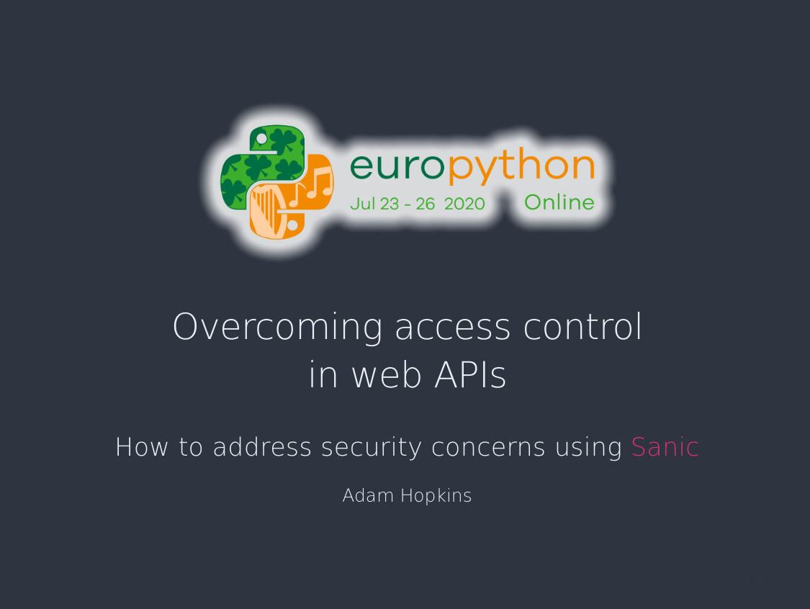

# Overcoming access control in web APIs

## How to address security concerns using Sanic

### Adam Hopkins 

Great, you've developed a great web API. Awesome, you are about to deploy it. But, how do you secure it and manage access?

Learn about different approaches to securing a web API whether it is meant for third-party integrations or driving a modern single-page application. Not all APIs are the same, so we will explore different considerations to make when crafting a solution to handle token-based authentication, and scoping to define access levels.

As one of the core developers of the async web framework Sanic, I will primarily focus on authentication and authorization tools inside Sanic to showcase how to address these issues. However, the concepts should be broadly applicable enough to take back and apply to any web API. The goal is to learn the hot spots, and identify strategies to overcome them.

Core take aways will include:
- how to implement various JWT strategies;
- best practices for storing JWTs on a browser; and
- controlling access privileges using structured scopes.

Time permitting, we will even discuss some tools to be used to help ease the anxiety and make security more approachable.

https://ep2020.europython.eu/talks/3TMWKW4-overcoming-access-control-in-web-apis/

https://www.youtube.com/watch?v=Uqgoj43ky6A
